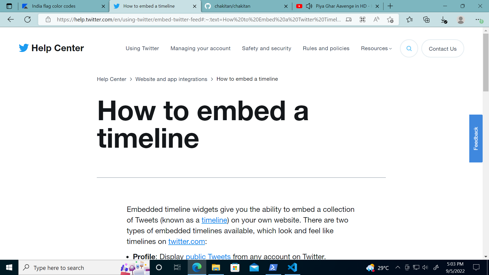

# Embed your Profile / Feed to WebPage

0. 
[Ref.](https://help.twitter.com/en/using-twitter/embed-twitter-feed#:~:text=How%20to%20Embed%20a%20Twitter%20Timeline%20on%20My,wherever%20you%20would%20like%20the%20...%20See%20More)

1. Go to https://publish.twitter.com/.
2. Enter the URL of the timeline you’d like to embed.
.png)
3. Customize the design by specifying the height and theme (light or dark) to match your website. 
.png)
4. Copy and paste the code into the HTML of your website wherever you would like the timeline to appear.
.png)
5. You're done!